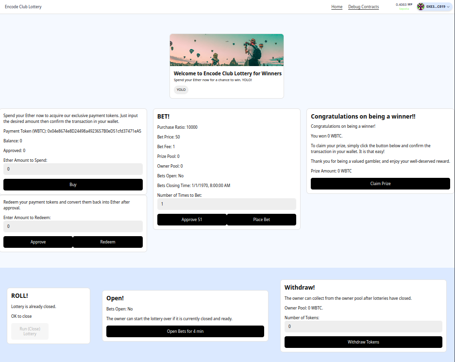

# Encode Club Lottery

deployed to Vercel: [Encode Club Lottery](https://encode-lottery.vercel.app/)

Encode Club Lottery is an onchain lottery using RanDAO for randomness. The lottery contract deploys its own ERC-20 token used for placing bets and receiving rewards. It's deployed on Sepolia so you will spend and receive fake real money (WBTC bought with ETH). 

Start by connecting your wallet in the upper right and then buy some fake WBTC. The purchase rato shows how many tokens you'll get for each fake ETH. When you're done you can convert the winnings and remaining tokens back to ETH by approving the lottery contract to redeem for you.

Placing bets is done by approving your WBTC and betting some positive integer number of times in one bet.

Winners can then claim prizes after the lottery has been "rolled", which ends the lottery and picks the winner.

The lottery owner can restart the lottery and withdraw earnings.